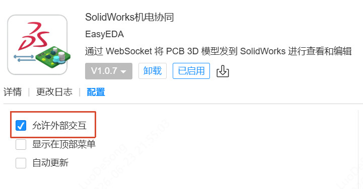

# SolidWorks Mechatronics Integration - EasyEDA Pro Extension

[中文](README.md) | English

This is the EasyEDA Pro side extension for SolidWorks integration, migrated from the official EasyEDA FreeCAD integration extension.

The extension handles:

- Exporting PCB 3D STEP files from EasyEDA
- Sending STEP file chunks to the local SolidWorks bridge service via WebSocket
- Listening for component moves, selections, deletions, and designator changes on the EDA side
- Receiving position synchronization, cross-probing, and deletion sync messages from the SolidWorks bridge service

> Note: This extension only covers the EasyEDA side. The SolidWorks side requires a separate bridge service implementation, with the default listening address at `ws://localhost:8767`.

## Usage

### Installing the Extension in EasyEDA

1. Open EasyEDA Pro.
2. Go to `Advanced -> Extension Manager`.
3. Click `Import` and select `build/dist/mcad-solidworks-sync_v1.0.0.eext`.
4. Enable `SolidWorks Mechatronics Integration` in the installed extensions list.
5. Grant the `External Interaction` permission to this extension, otherwise the WebSocket connection to the local bridge service will fail.


### Menu Entries

After installation, a `SolidWorks Mechatronics Integration` menu will appear in the top menu bar of the PCB editor:

- `Export 3D to SolidWorks`
- `Enable Bidirectional Interaction`
- `Stop Bidirectional Interaction`
- `Connect SolidWorks`
- `Disconnect SolidWorks`
- `Check SolidWorks Connection`

### Installing JLCICAN Toolbox

Note: You need SolidWorks 2016 or later to use the ICAN Toolbox.

1. Download the JLCICAN Toolbox: [https://ican.jlc.com](https://ican.jlc.com)
2. Extract and follow the tutorial to install the ICAN Toolbox.
3. Open SolidWorks, locate the ICAN Toolbox, and enable EDA interaction communication.

### Communication Protocol

The EDA extension connects as a WebSocket client:

```text
ws://localhost:8767
```

EDA -> SolidWorks Bridge Service:

- `file_upload_start`
- `file_upload_chunk`
- `build_mapping`
- `enable_monitor`
- `disable_monitor`
- `position_update`
- `cross_probe`
- `delete_object`
- `rename_designator`

SolidWorks Bridge Service -> EDA:

- `connection_confirmed`
- `upload_started`
- `chunk_received`
- `upload_complete`
- `import_started`
- `import_progress`
- `import_complete`
- `mapping_result`
- `position_update_from_solidworks`
- `cross_probe_from_solidworks`
- `delete_from_solidworks`
- `document_changed`
- `error`

Recommended `mapping_result` response format:

```json
{
	"type": "mapping_result",
	"mapping": [
		{
			"designator": "R1",
			"solidworksLabel": "R1"
		}
	]
}
```

## Build

```powershell
npm install
npm run build
```

The generated `.eext` file will be located at:

```text
build/dist/eext-mcad-integration-with-solidworks_v1.0.0.eext
```
