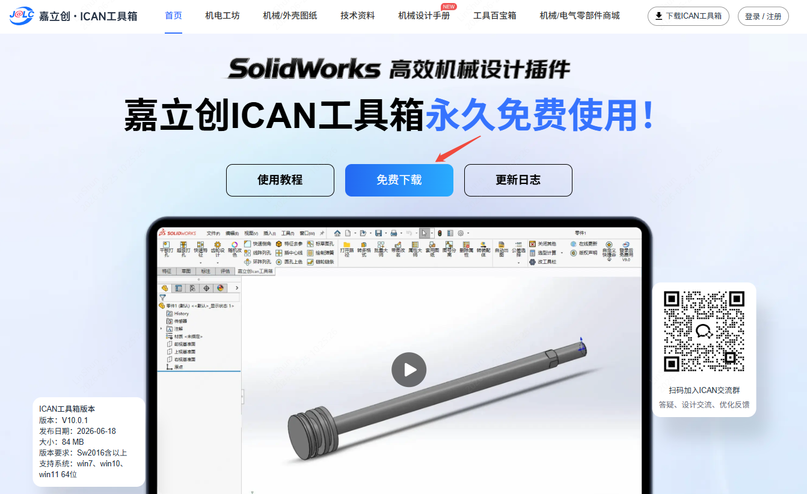
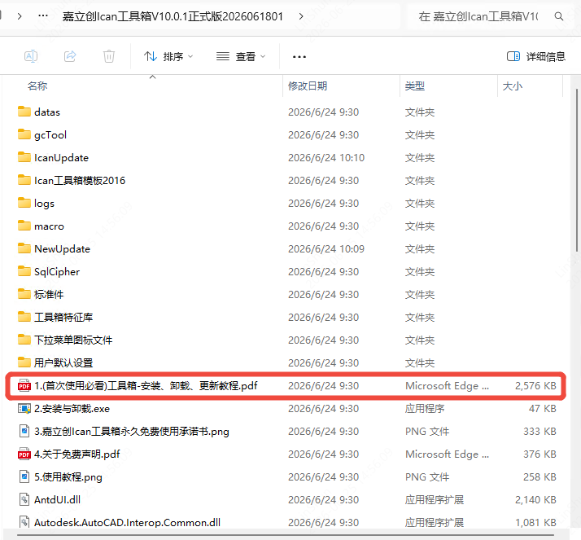
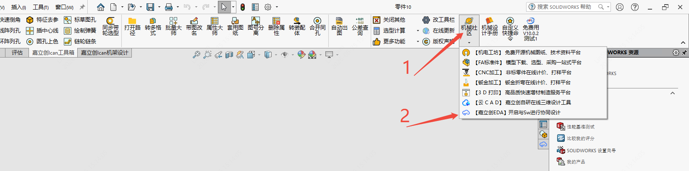
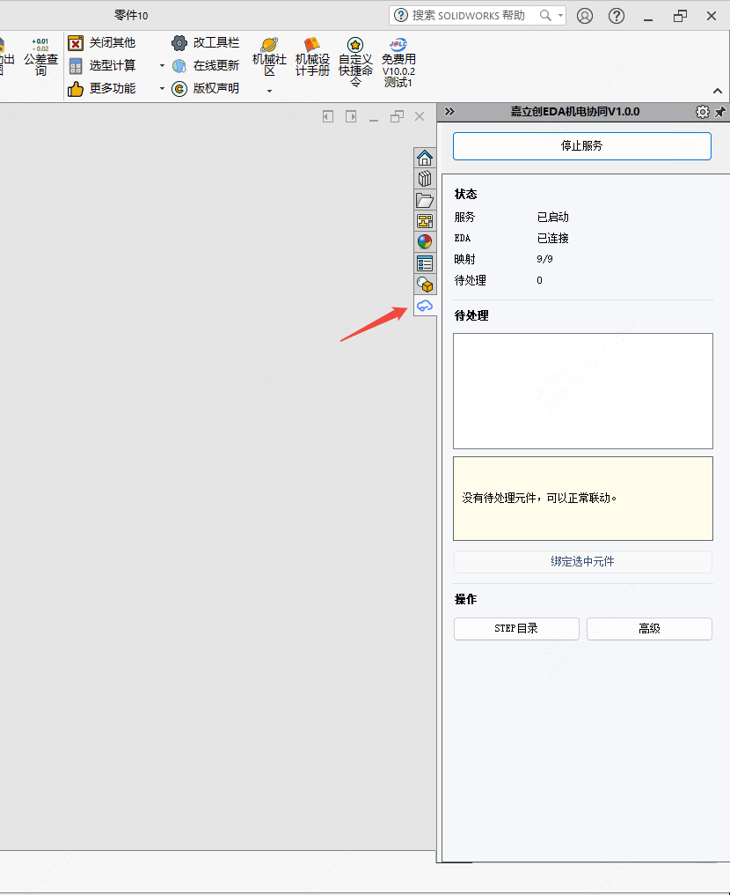
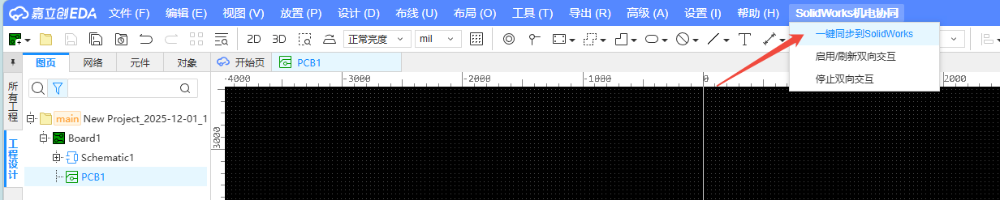
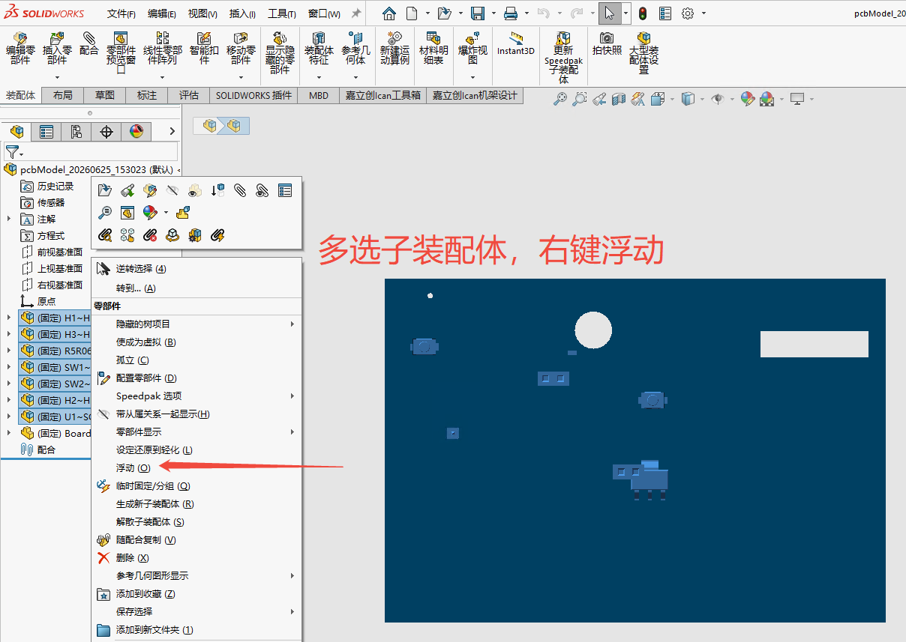
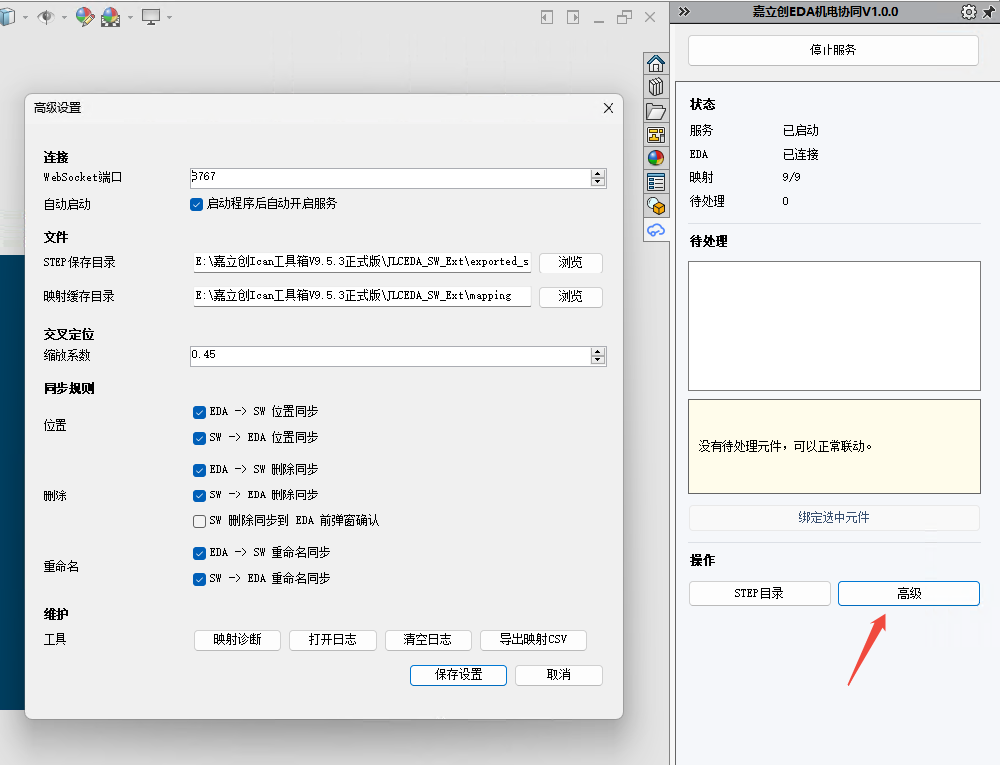

# SolidWorks Mechatronics Integration

[中文](README.md) | English

Real-time collaboration between EasyEDA and SolidWorks for PCB 3D models via WebSocket. Supports model export, bidirectional position synchronization, cross-probing, and deletion sync.

## Features
| Feature | Description |
|---------|-------------|
| 3D Model Export | Transfer PCB STEP models to SolidWorks in chunks |
| Bidirectional Position Sync | Move a component in EDA → SolidWorks follows, and vice versa |
| Cross-Probing | Click a component on one side, the other side auto-focuses |
| Deletion Sync | Delete a component in EDA, SolidWorks removes it simultaneously |

## Requirements
| Item | Requirement |
|------|-------------|
| SolidWorks | Version ≥ 2016 SP5 |
| EasyEDA Pro | Version ≥ 3.0 |
| Network | Localhost available |

## Usage

### Installing the Extension in EasyEDA

1. Open EasyEDA Pro.
2. Go to `Advanced -> Extension Manager`.
3. Click `Import` and select `build/dist/mcad-solidworks-sync_v1.0.0.eext`.
4. Enable `SolidWorks Mechatronics Integration` in the installed extensions list.
5. Grant the `External Interaction` permission to this extension, otherwise the WebSocket connection to the local bridge service will fail.

#### Menu Entries

After installation, a `SolidWorks Mechatronics Integration` menu will appear in the top menu bar of the PCB editor:

- `Export 3D to SolidWorks`
- `Enable Bidirectional Interaction`
- `Stop Bidirectional Interaction`
- `Connect SolidWorks`
- `Disconnect SolidWorks`
- `Check SolidWorks Connection`

### Installing JLCICAN Toolbox for SolidWorks
1. Go to the JLCICAN Toolbox official website to download the installer: https://ican.jlc.com/

2. The installer is a compressed file. Extract it and follow the installation tutorial PDF inside.

3. After installing the toolbox, open SolidWorks and create a new part. You will see the JLCICAN Toolbox toolbar. Click the Mechanical Community dropdown menu and enable the "Co-design with SW" button.

4. Once enabled, an EDA icon will appear in the right-side task pane of SolidWorks. Click it to show the interface.

5. The service starts automatically after enabling. You can now click the one-click sync button in the EasyEDA extension to import the PCB model into SolidWorks and start collaboration.

## Usage Notes
1. After importing into SolidWorks, you need to manually set all components to floating; otherwise the position sync feature will not work.

2. Click "Advanced" to configure file save location, synchronization rules, etc.

3. Large files (many components, complex 3D models) may take several minutes to import. During import, the SolidWorks interface may become unresponsive — this is normal.
